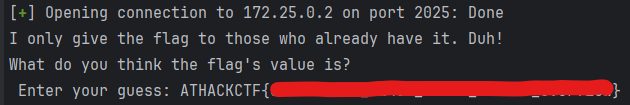

# Solution
The vulnerability consists of stack-based buffer overflow. Exploiting it requires no complicated payload.

## Using `poc.py`
- Get your python venv ready
    ```
    python -m venv venv
    source venv/bin/activate
    pip install -r requirements.txt
    ```
- Run `poc.py`
    ```
    # Replace the ip and port with corresponding ones
    python poc.py 127.0.0.1 2025
    ```

- You should get the flag dumped

  
